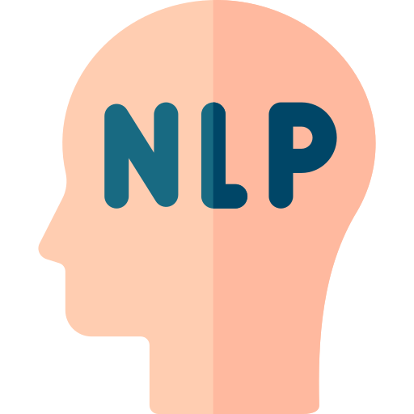

# Welcome to my GitHub!

I'm Rodrigo Pereira a specialist focused on transforming complex data into actionable insights and high-impact solutions.

## Expertise

- 17+ years of experience in Software Engineering, Data Science, and Data Analysis and relatd works. 
- MBA in Data Science, AI e Big Data – [PUC-RS](https://www.pucrs.br/) (2020-2021) 
- Master (MSc) in Computing Applied to Modeling and Simulation – [UNISINOS](https://www.unisinos.br/) (2014 - 2016) 
- Bachelor's Degree in Computer Science – [ULBRA](https://www.ulbra.edu.br/) (2004 - 2010)
- 6+ years Data Science 
- 4+ years leading teams
- 🤖 Data Scientist at of 2 AI projects for the Federal Government of Brazil

## Programming Languages, Databases & Clouds

-  Python
-  Oracle - PL/SQL
-  SQL
-  PostgreSQL
-  Microsoft SQL
-  AWS
-  Azure
-  Google Cloud Platform
-  Databricks Azure

## Data Science

-  Jupyter Notebook
-  Pandas
-  Numpy
-  Matplotlib
-  Seaborn

## Machine Learning Frameworks

-  Scikit-Learn
-  TensorFlow
-  PyTorch
-  Keras
-  MLflow
-  NLP

## Data Engineering, DevOps & MLOPs 

-  Docker
-  Kubernetes
-  Git
-  CI / CD
-  ML Flow
-  Airflow

## Data Vizualization, Reporting & Analytics

-  Power BI
-  Tableau
-  Google Looker
-  Streamlit
-  Power Point
-  Excel

## Tools

-  VS Code
-  GitHub
